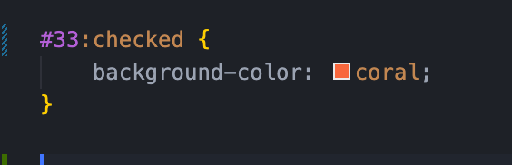
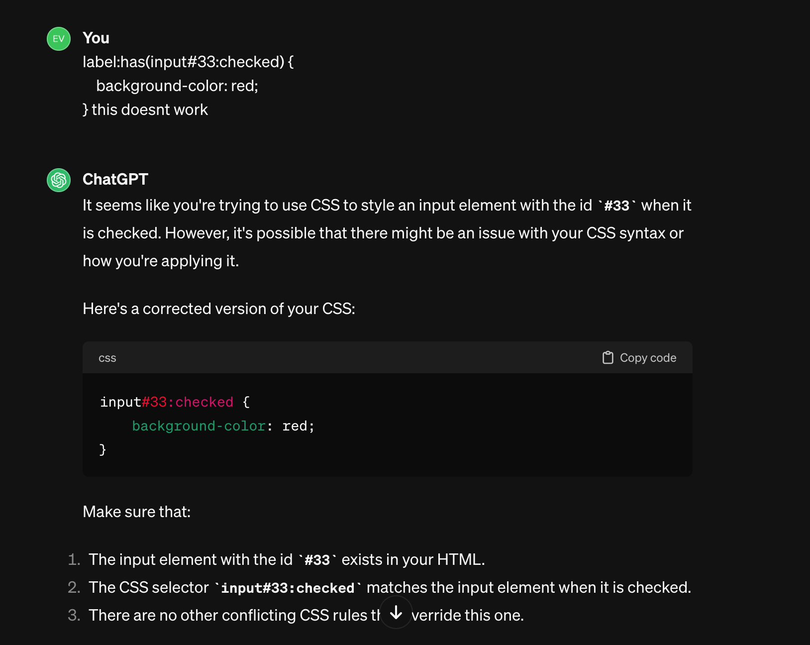
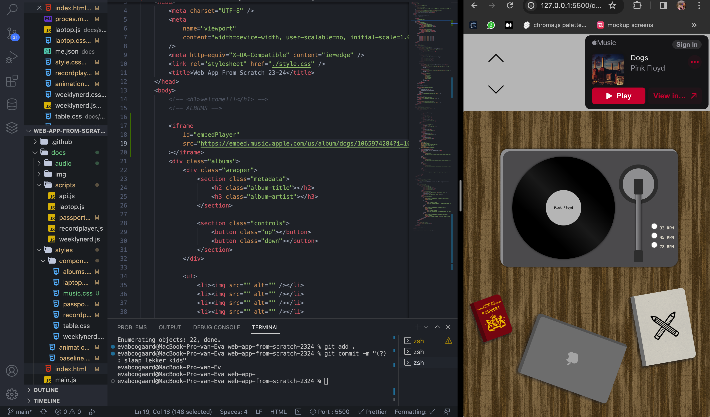
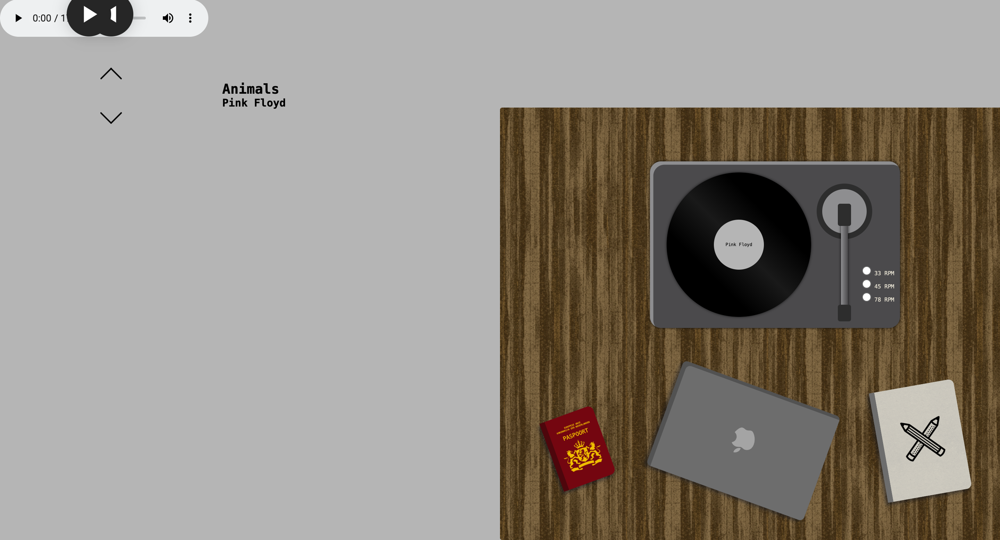
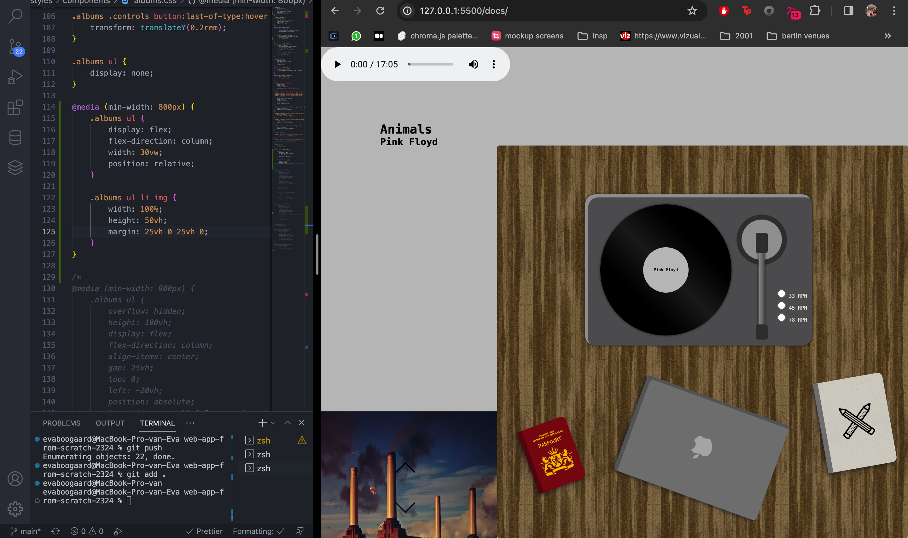
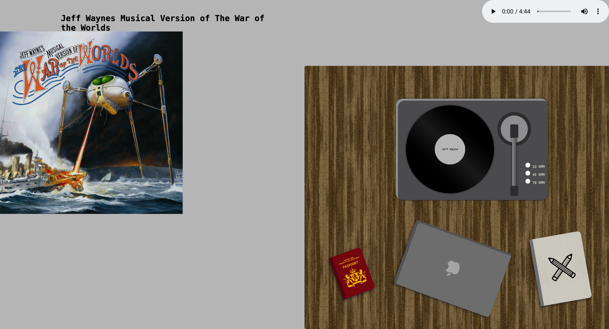

# Proces WAFS

Welkom!!! Bij dit prachtige procesboek!!!!!!!! Let's dive right in :)

## Table of Contents

[Maandag 5 feb](#5feb)  
[Dinsdag 6 feb](#6feb)  
[Woensdag 7 feb](#7feb)  
[Donderdag 8 feb](#8feb)  
[Vrijdag 9 feb](#9feb)  
[Maandag 12 feb](#12feb)

<a name="5feb"/>

## Maandag 5 feb

Ideeën:

-   GBA of NDS, met een pokemon look & feel (pixel art) en daarin een soort game, een backpack met items, of een pokedex met dingen die mij beschrijven
-   Windows XP simulation met allemaal icons. Ik vond dit idee stom toen ik er te lang over na ging denken. Icons waren wel cool (die kan je dus allemaal downloaden in een zipje!!!!! wauw!)
-   Hierna heb ik opgegeven en ben ik naar huis gegaan!!!!!!!! Morgen nieuwe kansen <3

<a name="6feb"/>

## Dinsdag 6 feb

-   Oke nieuwe dag nieuw concept: een turntable met mijn favoriete albumpies ernaast, en dan iets van een titel en artiest ernaast. Dat moet allemaal dynamisch veranderen. Geen idee hoe.
-   Uiteindelijk is het concept omgevormd naar een tafel waar de platenspeler op staat, samen met een paspoortje en een landkaart. Het paspoort moet dan persoonlijke info over mij weergeven & de landkaart de weeklynerd talks.
-   Eerste fetch gedaan!!! Was super leuk would recommend 10/10

<a name="7feb"/>

## Woensdag 7 feb

-   ik heb een paspoortje toegevoegd aan de tafel, als je erop klikt komt de content in beeld. Ik zat nogal te struggelen met hoe ik dit in een soort paspoort layout moest krijgen, want ik wilde eigenlijk een ul met li items gebruiken. Dit kreeg ik echter met geen mogelijkheid goed voor elkaar, dus heb ik alles toch omgegooid naar div’jes en heb ik 2 sections gemaakt waarvan de parent een display: flex kreeg.

-   ik heb mijn concept nog een keer nagelopen en nog een soort final sketch gemaakt:

<a name="8feb"/>

## Donderdag 8 feb

-   weeklynerd notebook btn gemaakt (toch geen landkaart want i have a life)
-   het aanpassen van de api data werkt niet meer als ik de images kleiner maak dus ik moet ff opnieuw beginnen. ik deed het dus eerst zo op basis van de scrollposition, maar dat werkte niet meer als de items kleiner werden (duh). nu voeg ik dus de ‘active’ class toe op basis van de clicks op de up- en down buttons. hier checkt hij dus elke keer als er geklikt wordt wat de currentActiveIndex moet worden.

-   Killian Valkhof heeft gister gepraat over carousels en hoe je deze met pure html en css kunt maken, ik heb dit tnt alleen nog in js gedaan. Dit wil ik dus nog aan gaan passen, in het kader van ‘make it work, make it good, make it pretty’.

-   einde vd dag progress

<a name="9feb"/>

## Vrijdag 9 feb

-   wilde de radio buttons de speed of sound laten veranderen maar dat lukte niet. uiteindelijk was het probleem niet zo ingewikkeld en moest ik mijn id names veranderen en een beetje klooien met selectors. opvallend is wel dat chatgpt dit niet doorhad en zei dat ik prima een nummer als id kon gebruiken (was niet zo)

-   audio vanuit apple music geprobeerd, was tantoe lelijk, uiteindelijk gekozen voor mp3'tjes die worden ingeladen met controls die worden veranderd als JS actief is bij de gebruiker (door domcontentloaded).
    
    

-   kreeg opeens vet veel errors in console, lag aan een regel in mn script
    
    

-   ik wil dat als er geen JS actief is bij de gebruiker, de controls van de audio zichtbaar zijn, en als er wel JS te gebruiken is dat er dan custom controls zijn

-   js carousel naar css scroll-snap carousel. snapte er geen hol van maar het is gelukt alleen nog niet met pijltjes die klikbaar zijn dus het is niet toegankelijk. NOG niet toegankelijk.

-   als er een nummer speelt en je switcht naar een ander album, dan blijft de playing animatie wel maar stopt de muziek, waardoor de toggle niet lekker werkt. wordt ff geparkeerd want geen prio. net als de scrollbar die niet weg wil.

<a name="12feb"/>

## Maandag 12 feb
